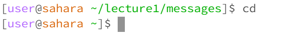
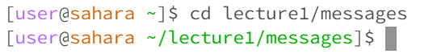
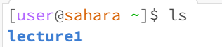
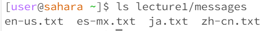
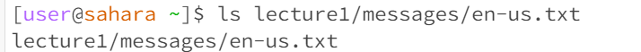
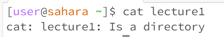
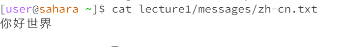

# *Lab Report 1*

# cd:
## Without arguments:

> cd returns to the home directory by default

pwd:/home

## with a path to a directory:

> cd changes the current directory to the new directory if a directory is given

pwd:/home/lecture1/messages

## with a path to a file:

> cd can only accept a path to a directory, so it won't work if a path to a file is given

pwd:/home/lecture1/messages

# ls:
## Without arguments:

pwd:/home/lecture1/messages

## with a path to a directory:

pwd:/home/lecture1/messages

## with a path to a file:
\
pwd:/home/lecture1/messages

# cat:
## Without arguments:
\
pwd:/home/lecture1/messages

## with a path to a directory:
\
pwd:/home/lecture1/messages

## with a path to a file:
\
pwd:/home/lecture1/messages
