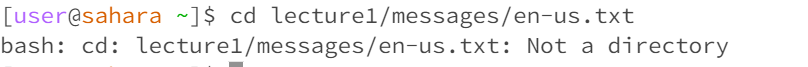

# *Lab Report 1*

# cd:
## Without arguments:

> cd returns to the home directory by default

pwd:/home\
Note: It works properly.

## with a path to a directory:

> cd changes the current directory to the new directory if a directory is given

pwd:/home/lecture1/messages\
Note: It works properly.

## with a path to a file:

> cd can only accept a path to a directory, so it won't work if a path to a file is given

pwd:/home\
Note: It's an error.

# ls:
## Without arguments:

> ls will list all the elements under the current directory. In this case, the folder under /home is listed by default.

pwd:/home\
Note: It works properly.

## with a path to a directory:

> ls will list all the elements under the current directory. In this case, files under the /messages are listed.

pwd:/home\
Note: It works properly.

## with a path to a file:

>In this case, since a path to the file is given. The ls command will display the direct path to the file instead.

pwd:/home\
Note: It works properly.

# cat:
## Without arguments:

>The command cat is used to display what's given in the argument. In this case, since nothing is given, it will repeat whatever the user enters.
 
pwd:/home\
Note: It works properly.

## with a path to a directory:

>In this case, we passed in a directory as an argument, so it tells the user it's a directory, as expected.

pwd:/home\
Note: It works properly.

## with a path to a file:

>In this case, we passed in a path to a file as an argument, so it displays the content of the file.

pwd:/home\
Note: It works properly.
