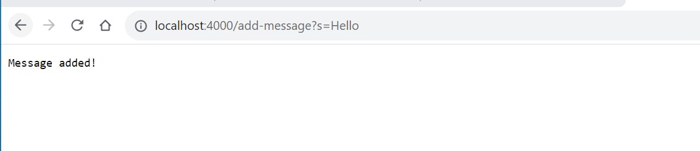
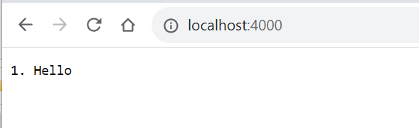
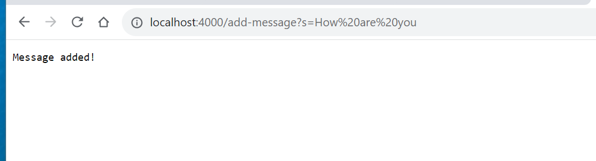
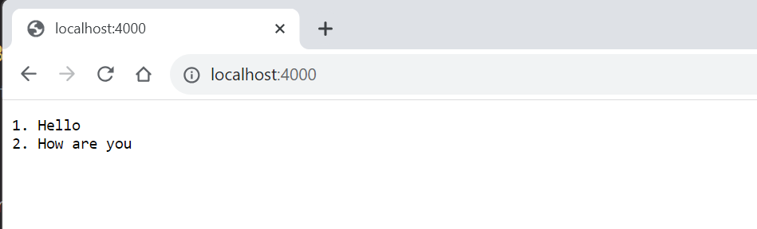
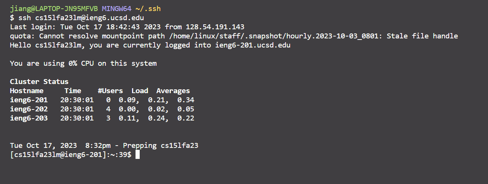

# Part 1
## Code of my stringserver
```
import java.io.IOException;
import java.net.URI;
import java.io.*;
import java.util.*;

class Handler implements URLHandler {
    // The one bit of state on the server: a number that will be manipulated by
    // various requests.
    Vector<String> database = new Vector<String>();
    String result = "Search result:";
    int index = 1;
    
    public String handleRequest(URI url) {
        String show ="";
        if (url.getPath().equals("/")) {
            for(int i = 0; i < database.size();i++)
            {
                show += index+". ";
                show += database.get(i) +"\n";
                index++;
            }
            return String.format(show);
        } 
         else 
         {
            if (url.getPath().contains("/add-message")) {
                String[] parameters = url.getQuery().split("=");
                if (parameters[0].equals("s")) {
                   database.add(parameters[1]);
                   return String.format("Message added!");
                }
            }
             return "404 Not Found!";
         } 
        
    }
}

class stringserver {
    public static void main(String[] args) throws IOException {
        if(args.length == 0){
            System.out.println("Missing port number! Try any number between 1024 to 49151");
            return;
        }

        int port = Integer.parseInt(args[0]);

        Server.start(port, new Handler());
    }
} 
```
## Screenshots of /add-message?s=Hello

* method called: /add-message
* Arguments: String(Hello)
* Things can be changed: if we change the Query of the link(the parts that come after? and before #), the content will be changed.
For example, the apple message will be added instead if we change the Query to s=apple.


* method called: /
* Arguments: none
* Things can be changed: By default, the method will lead to the homepage. The homepage can be changed after methods are called by adding extra content to the URL.
  
## Screenshots of /add-message?s=How are you

* method called: /add-message
* Arguments: String(How are you)
* Things can be changed: Again, if we change the Query of the link, the content will be changed.
  

* method called: /
* Arguments: none
* Things can be changed: By default, the method will lead to the homepage. The homepage can be changed after methods are called by adding extra content to the URL.

# Part 2
* The path to the private and the public key for logging into ieng6:


* Logging in to the server without the password:



