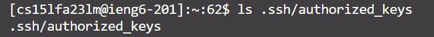

# Part 1
## Code of my stringserver
```
import java.io.IOException;
import java.net.URI;
import java.io.*;
import java.util.*;

class Handler implements URLHandler {

    String result ="";
    int index = 1;


    public String handleRequest(URI url) {
        if (url.getPath().equals("/")) {
            return String.format(result);
        } 
         else 
         {
            if (url.getPath().contains("/add-message")) {
                String[] parameters = url.getQuery().split("=");
                if (parameters[0].equals("s")) {
                   result += index + ". " + parameters[1] + "\n\n";
                   index++;
                   return String.format(result);
                }
            }
             return "404 Not Found!";
         } 
        
    }
}

class stringserver {
    public static void main(String[] args) throws IOException {
        if(args.length == 0){
            System.out.println("Missing port number! Try any number between 1024 to 49151");
            return;
        }

        int port = Integer.parseInt(args[0]);

        Server.start(port, new Handler());
    }
}


```
## Screenshots of /add-message?s=Hello

* method called: handleRequest
* Arguments: URI url
* Classfiled: index: the order of the message that's added   result: the string that is used to store all the message
* Things can be changed: Every time calls the method and triggers this query reaction, or adds a message, the parameter array will break the whole given query and see the "=" as the divider. If the query starts with "s=", then the show variable will add a combined string makeup of the index + dot + parameter[1](the message we want to add) + next next line. Next, the index will increase by 1, so everytime we add a string the order matches. Before the call, the result string ="", and the index =1. After the call, the result string = "1. Hello\n\n", and the index = 2.
  
## Screenshots of /add-message?s=How are you

* method called: handleRequest
* Arguments: URI url
* Classfiled: index: the order of the message that's added   result: the string that is used to store all the message
* Things can be changed: Every time calls the method and triggers this query reaction, or adds a message, the parameter array will break the whole given query and see the "=" as the divider. If the query starts with "s=", then the show variable will add a combined string makeup of the index + dot + parameter[1](the message we want to add) + next next line. Next, the index will increase by 1, so everytime we add a string the order matches. In this case, we added the message twice. Before the call, the result string ="", and the index = 1. After the first call, the result string = "1. Hello \n\n", and the index = 2. After the second calls, the result string = "1. Hello \n\n 2. How are you\n\n", and the index = 3.
  

# Part 2
* The path to the public key for logging into ieng6:
  


* The path to the private key for logging into ieng6:
  


* Logging in to the server without the password:


# Part 3
In week 2, I learned how to use ssh to connect and interact with other computers by using ssh. I learned how to make websites with simple functions using Java. In week 3, we went over how to create ssh keys, which is very convenient for logging in remote computer. I was really impressed and felt I made a big step forward in my programming field.
