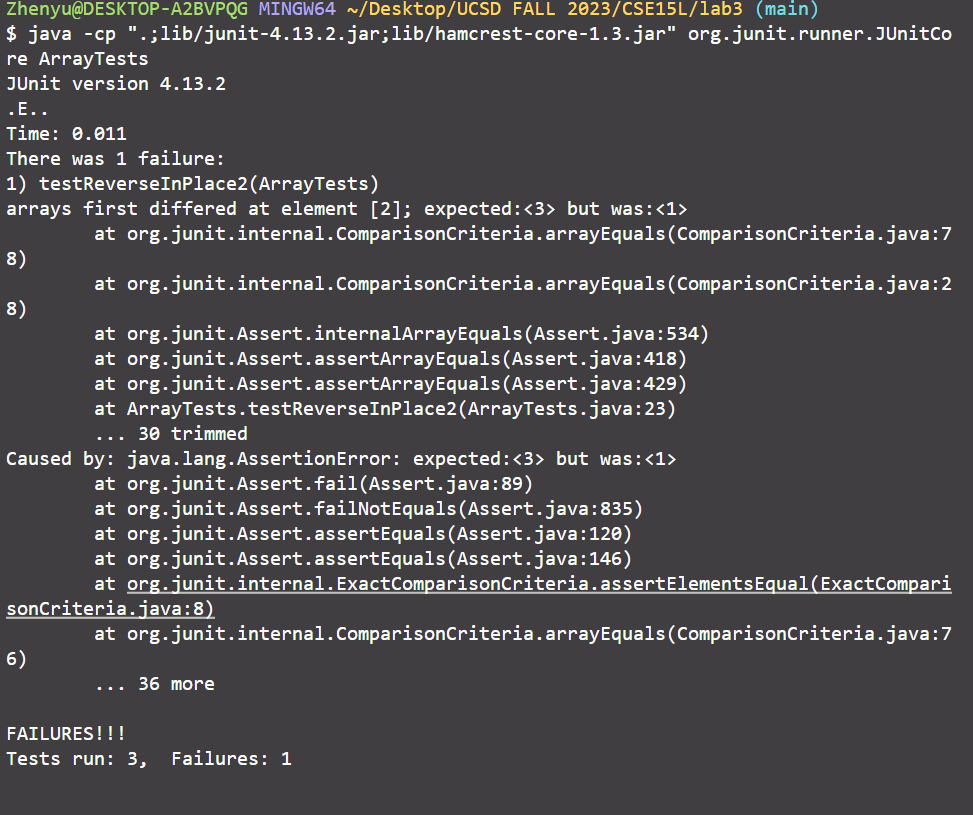

# Part 1:
## A failure-inducing input
```
 @Test 
public void testReverseInPlace2() {
    int[] input1 = { 3,2,1 };
    ArrayExamples.reverseInPlace(input1);
    assertArrayEquals(new int[]{1,2,3}, input1);
}
```
## An input that doesn’t induce a failure
```
@Test 
public void testReverseInPlace() {
    int[] input1 = { 3, 3, 3 };
    ArrayExamples.reverseInPlace(input1);
    assertArrayEquals(new int[]{ 3, 3, 3 }, input1);
}
```
## The symptom


## The bug
### before fixed
```
  // Changes the input array to be in reversed order
  static void reverseInPlace(int[] arr) {
    for(int i = 0; i < arr.length; i += 1) {
      arr[i] = arr[arr.length - i - 1];
    }
  }
```

### after fixed
```
  // Changes the input array to be in reversed order
  static void reverseInPlace(int[] arr) {
    int temp = 0;
    for(int i = 0; i < arr.length/2; i += 1) {
      temp = arr[i];
      arr[i] = arr[arr.length - i - 1];
      arr[arr.length - i - 1] = temp;
    }
  }
```
* In the original code, it doesn't save values in the previous index before the reverse. After the swap, the array will lose those values. By adding a variable to save the original value and replacing the target element with the saved value, we can make sure the swap function works properly (the current index exchanges value with the target index). We also want to shrink the loop into half of the string to let the swap work correctly.

# Part 2:
I choose to explore the usage of the grep command, and all info is from https://www.geeksforgeeks.org/grep-command-in-unixlinux/

## 1. grep -c  (it will list the number of the matching content)
* Example 1: list out the number of lines that have ".txt" in the file.txt file
  
The directory that we use:
```
cat files.txt
some-files/a.txt
some-files/even-more-files/a.txt 
some-files/even-more-files/d.java
some-files/more-files/b.txt      
some-files/more-files/c.java 
```  
The code to show target files:
```
grep ".txt" files.txt
```
The output:
```
some-files/a.txt
some-files/even-more-files/a.txt
some-files/more-files/b.txt
```
The code to show grep -c:
```
grep -c ".txt" files.txt
```
The output:
```
3
```


* Example 2: list out the number of lines that have "void", or for our purpose, counting how many void functions in that Java code
  
The Java code that we will use to demostrate
```
public class ArrayExamples {

  // Changes the input array to be in reversed order
  static void reverseInPlace(int[] arr) {
    int temp = 0;
    for(int i = 0; i < arr.length/2; i += 1) {
      temp = arr[i];
      arr[i] = arr[arr.length - i - 1];
      arr[arr.length - i - 1] = temp;
    }
  }

  // Returns a *new* array with all the elements of the input array in reversed
  // order
  static int[] reversed(int[] arr) {
    int[] newArray = new int[arr.length];
    for(int i = 0; i < arr.length; i += 1) {
      arr[i] = newArray[arr.length - i - 1];
    }
    return arr;
  }

  // Averages the numbers in the array (takes the mean), but leaves out the
  // lowest number when calculating. Returns 0 if there are no elements or just
  // 1 element in the array
  static double averageWithoutLowest(double[] arr) {
    if(arr.length < 2) { return 0.0; }
    double lowest = arr[0];
    for(double num: arr) {
      if(num < lowest) { lowest = num; }
    }
    double sum = 0;
    for(double num: arr) {
      if(num != lowest) { sum += num; }
    }
    return sum / (arr.length - 1);
  }
}
```

The code to show grep -c:
```
cat ArrayExamples.java | grep -c "void"
```
The output:
```
1
```


Without the -c, the grep will show all the matching lines in the file.txt file. However, when we want to know how many lines ".txt" is in a very long file, we wouldn't like to count how many lines in the command prompt. Instead, adding a -c in the grep command just tells you how many lines are matching right away. It's more useful when we try to count some patterns in a long text file. 

## 2. grep -l  (it will list the filename of the matching content)
* Example 1: list out all the filename of files that have a pattern "for" under the lab3 directory, and directories themselves will not be checked
  
The code to show grep -l:
```
grep -l "for" *
```
The output:
```
ArrayExamples.java
FileExample.java
grep: lib: Is a directory
LinkedListExample.java
ListExamples.java
```

* Example 2: list out the filename of files that have a pattern "main", or for our purpose, count how many Java programs have the main class under the lab3 directory

The code to show grep -l:
```
grep -l "main" *
```
The output:
```
grep: lib: Is a directory
```

The additional -l will list out the filename for files that have the matching content, it's useful if we try to find a certain program or text file but we only remember some keywords.

## 3. grep -w  (it will list lines that exactly match the whole word)
* Example 1: list out the names of files that have the whole word "for" under ArrayExamples.java
  
The code to show grep -w:
```
grep -w "for" ArrayExamples.java
```
The output:
```
for(int i = 0; i < arr.length/2; i += 1) {
for(int i = 0; i < arr.length; i += 1) {
for(double num: arr) {
for(double num: arr) {
```

* Example 2: list out the names of files that have the whole word "fo" under ArrayExamples.java
  
The code to show grep -w:
```
grep -w "fo" ArrayExamples.java
```
The output:
```
```

The additional -w will list out the lines that have the exact matching content, it's useful if we try to find lines that have the exact keyword from a large amount of files.

## 4. grep -v  (it will list lines that do not match the pattern)
* Example 1: list out the number of lines that don't have "txt" in the file.txt file

The directory that we use:
```
cat files.txt
some-files/a.txt
some-files/even-more-files/a.txt 
some-files/even-more-files/d.java
some-files/more-files/b.txt      
some-files/more-files/c.java 
```  
The code to show grep -v:
```
grep -v "txt" files.txt
```
The output:
```
some-files/even-more-files/d.java
some-files/more-files/c.java
```

* Example 2: list out the number of lines that don't have "java" in the file.txt file
  
The code to show grep -v:
```
grep -v "java" files.txt
```
The output:
```
some-files/a.txt
some-files/even-more-files/a.txt
some-files/more-files/b.txt
```

The additional -v will list out the lines that do not have the matching content, it's useful if we try to filter out certain information that we don't want to see from files.

