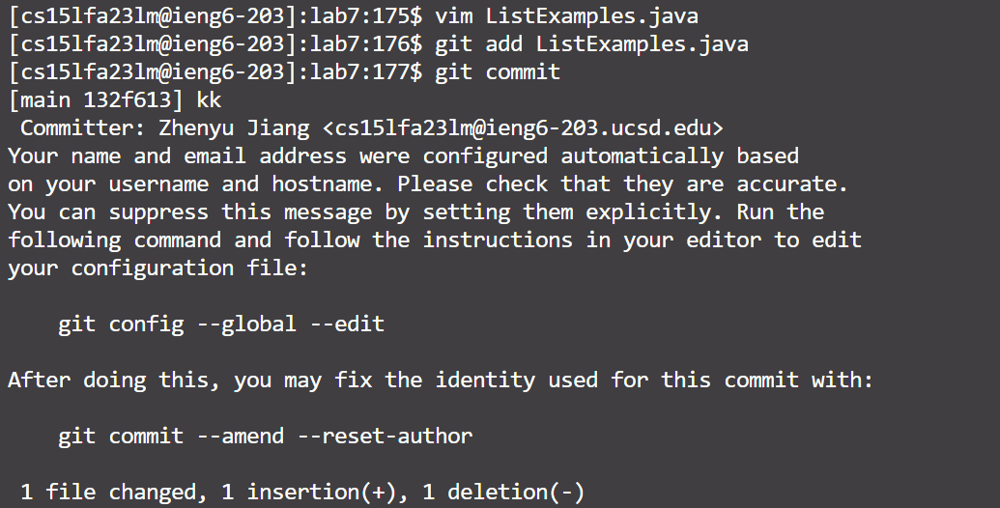

# Lab Report 4
## Step 4:

- Key Pressed: \<ctrl r> \<ctrl v> \<enter>
  
I did a copy and pasted using \<ctrl r> <ctrl v> from the Google Doc to the terminal

## Step 5:

- Key Pressed: git clone [githublink] \<enter>

I did a clone from my GitHub repository to the ieng6 server using the link by typing git clone + link

## Step 6:

- Key Pressed: cd lab7, bash test.sh \<enter>

I open the cloned folder with cd + filename, and run the test program with bash + filename command.

## Step 7:

- Key Pressed: vim ListExamples.java \<enter> :44 \<enter> e x i 2 \<esc> :qw \<enter>

I open the buggy program with the vim command, and then I jump to line 44, where the bug is located, with : + number. Then, I moved my cursor to the end of the word by typing e, deleted the last character with x, pressed i to get into the insert mode, and then put number 2 in to fix the bug. Lastly, I press esc to exit the insert mode and save and quit the file with :wq.

## Step 8:

- Key Pressed: bash test.sh \<enter>

I run the test program again with bash + filename command.

## Step 9:

- Key Pressed: git add ListExamples.java git commit i x \<esc> :wq

I add the changes to my commit by typing git add + filename, and then I try to do a github commit to my github by typing git commit. Then I enter the vim mode to provide a commit message. Therefore, I press i to get into the insertion mode, type my message "x", quit the insert mode with esc, and save the message and quit the vim mode with :wq. Then, the commit is finished and my file in GitHub repository are updated.
  
