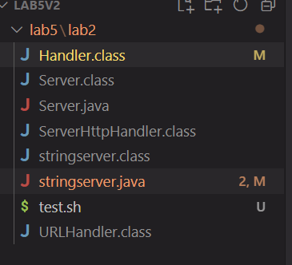
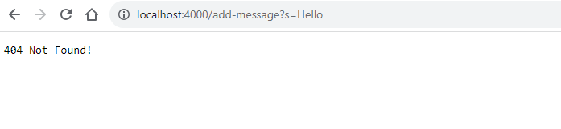
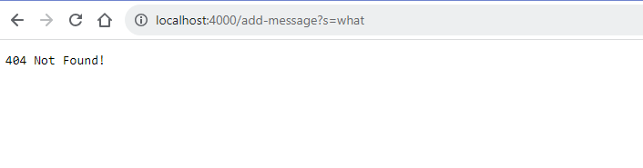
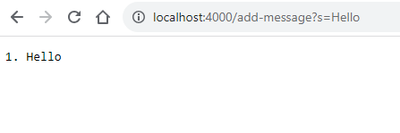
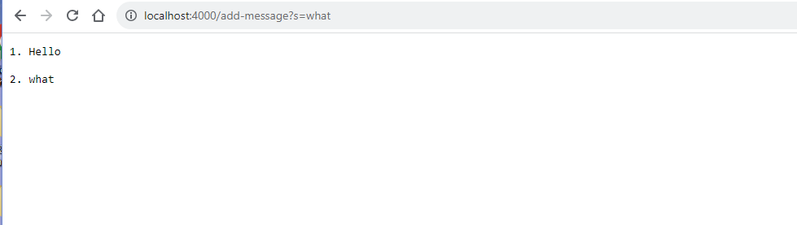
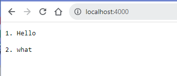

# Part1
## Question about my printing code #99

### StudentA
##### 1d ago in **General**

Hello, I'am trying to add a message to my webserver by using the add-message in my headleRequest function. If the url includes a path with "add-message" and a query starting with s and followed by = +"message", a message will be added to the server and show up on the homepage However, no matter how I tried, I could not add messages and nothing was on the homepage. I believe I did everything correctly, but for some reason, it could not work out! Can you guys take a look and help?

My code:
```
import java.io.IOException;
import java.net.URI;
import java.io.*;
import java.util.*;

class Handler implements URLHandler {

    String result ="";
    int index = 1;


    public String handleRequest(URI url) {
        if (url.getPath().equals("/")) {
            return String.format(result);
        } 
         else 
         {
            if (url.getPath().contains("/add-message")) {
                String[] parameters = url.getQuery().split("=");
                if (parameters[0].equals(" s")) {
                   result += index + ". " + parameters[1] + "\n\n";
                   index++;
                   return String.format(result);
                }
            }
             return "404 Not Found!";
         } 
        
    }
}

class stringserver {
    public static void main(String[] args) throws IOException {
        if(args.length == 0){
            System.out.println("Missing port number! Try any number between 1024 to 49151");
            return;
        }

        int port = Integer.parseInt(args[0]);

        Server.start(port, new Handler());
    }
}
```
The bash file code:
```
javac stringserver.java Server.java
java stringserver 4000
```
File structure:



The error:





**Comment** 

# 1 Answer
### JoJo ***STAFF***
#### 1h ago

- Yes you are right, most of your code is working fine and the logic is making sense. However, be super careful when you are using string variables and passing them into functions or as an argument. Your string has to be 100 percent correct and with no extra characters like space or . or _. Try to check all the strings you have created so far and make sure they are exactly what you are expected.
  
Hopefully that helps! :D

**Comment** 

 ##### StudentA
 Based on what you said, I checked all the strings in my program. I just found out I accidentally typed an extra space on line 20. 
```
if (parameters[0].equals(" s")) {
```
 It should be "s" instead of " s", and my program works after fixing that! I do need to be super careful next time when I deal with strings since any mistake in the string content can run the whole program, just like solving math! Thanks for the help!

Correct code:
```
import java.io.IOException;
import java.net.URI;
import java.io.*;
import java.util.*;

class Handler implements URLHandler {

    String result ="";
    int index = 1;


    public String handleRequest(URI url) {
        if (url.getPath().equals("/")) {
            return String.format(result);
        } 
         else 
         {
            if (url.getPath().contains("/add-message")) {
                String[] parameters = url.getQuery().split("=");
                if (parameters[0].equals("s")) {
                   result += index + ". " + parameters[1] + "\n\n";
                   index++;
                   return String.format(result);
                }
            }
             return "404 Not Found!";
         } 
        
    }
}

class stringserver {
    public static void main(String[] args) throws IOException {
        if(args.length == 0){
            System.out.println("Missing port number! Try any number between 1024 to 49151");
            return;
        }

        int port = Integer.parseInt(args[0]);

        Server.start(port, new Handler());
    }
}


```

The output after fixing :







# Part 2
Something I learned very useful is to how to use cd, ls, cat, echo, and grep those basic Linux commands to manipulate the terminal since those are the most basic skills that I need when I become a software engineer in the future. The second cool thing is to learn the structure of url and how to write a program to build my server, this allows me to make my own little website purely using java with cool functionalities which is impressive and interesting. Lastly, I found out the debugger is also very helpful when I write more complex programs in the future since debugging is always painful and time-consuming. With the jdb, I get a handy tool to tell me which lines is triggering the error and what happen to my variables when the code run certain line. Overall, CSE 15L lectures and labs are very useful  for my future career.
